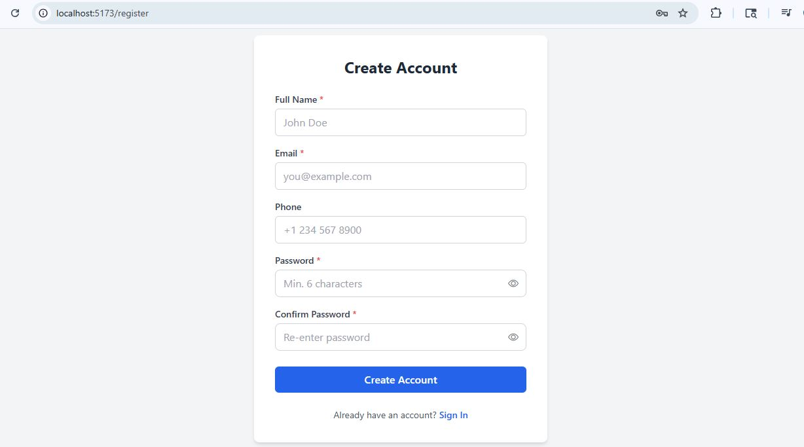
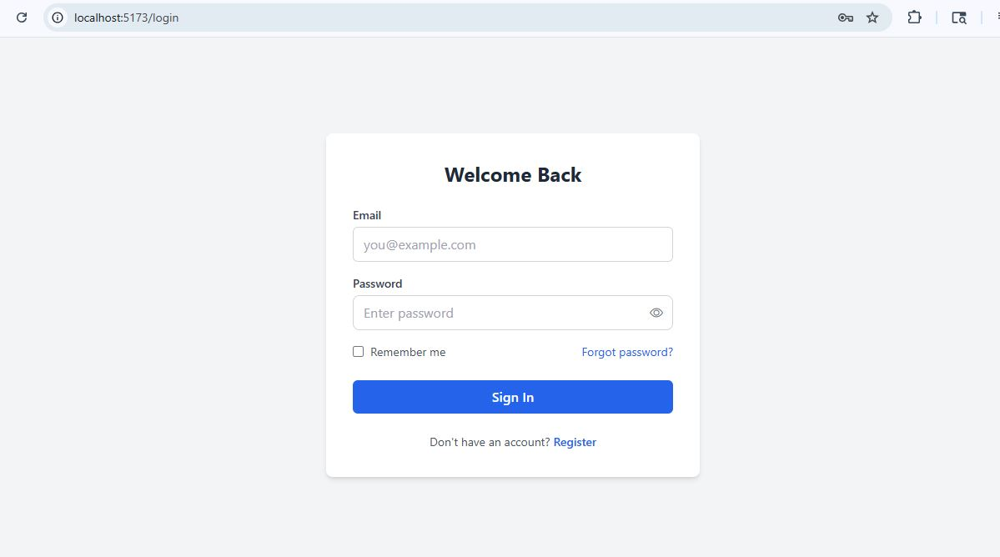
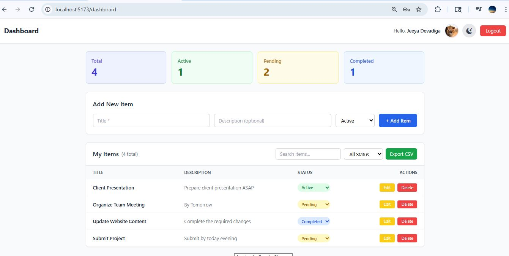
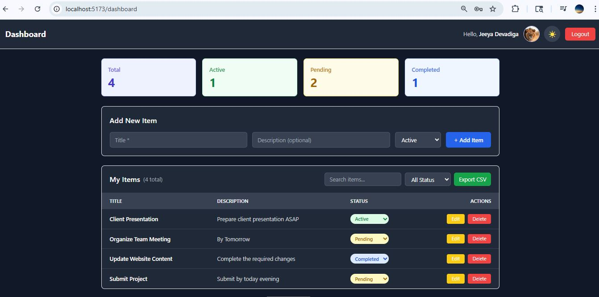
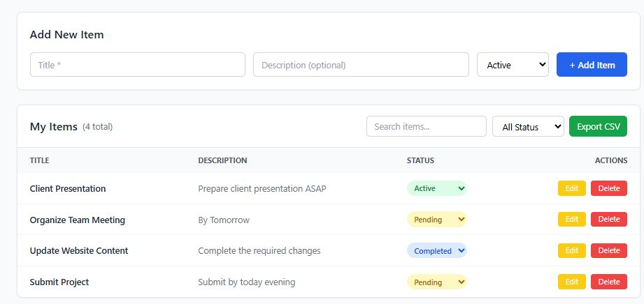
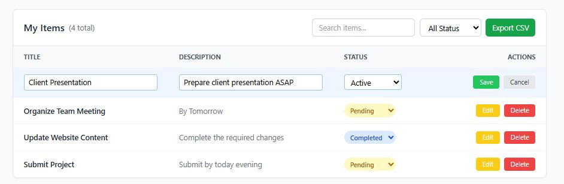
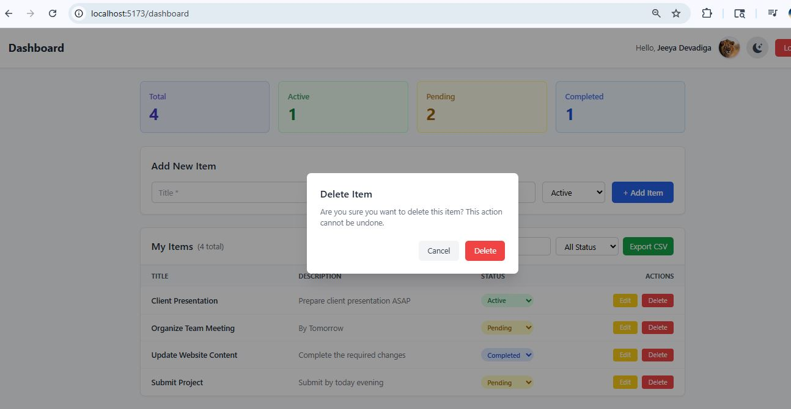
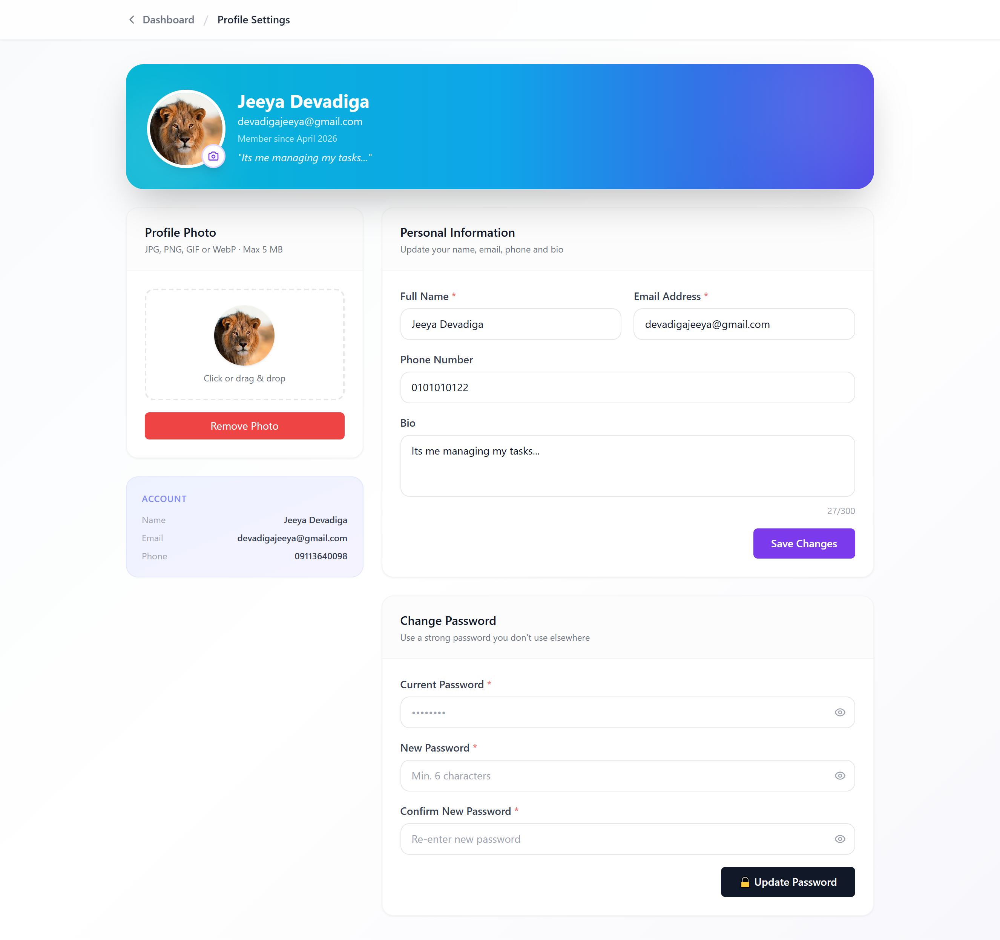
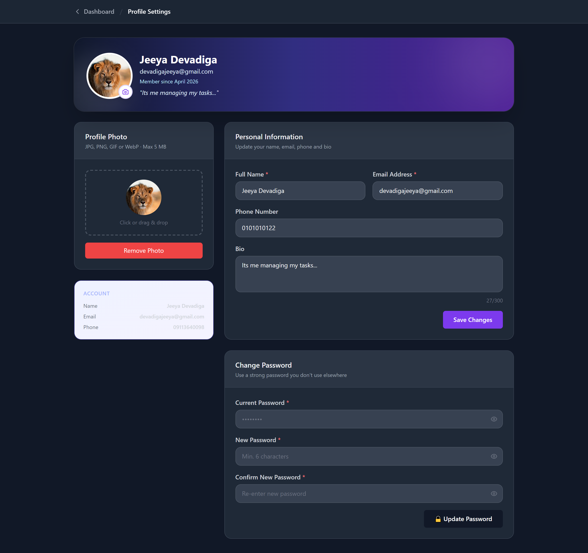
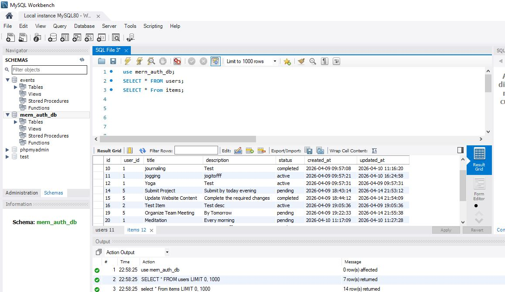

## Task Management Dashboard using MERN Stack and MySQL

A full-stack **Task Management Web Application** built using the **MERN stack architecture with MySQL database integration**.  
This project includes **JWT-based authentication, complete CRUD operations, dark mode UI, profile management with avatar upload, search/filter, pagination, and responsive dashboard design**.

---

## Live Demo

🔗 **Live Demo:** 


---

## Features

### Authentication & Security
- User Registration
- Secure Login / Logout
- JWT Authentication
- Protected Routes
- Password Change
- Forgot Password & Reset Password
- bcrypt password hashing
- Token-based session management

---

### Dashboard Features
- Add New Tasks / Items
- View All Tasks
- Edit Existing Tasks
- Delete with Confirmation Modal
- Status Update (Active / Pending / Completed)
- Search functionality
- Filter by status
- Pagination
- Statistics cards
- Export CSV
- Responsive UI

---

### Profile Management
- Update Name
- Update Email
- Update Phone
- Update Bio
- Avatar Upload
- Avatar Delete
- Profile Settings Page
- Dashboard avatar sync
- Fallback initials when no avatar exists

---

### UI / UX Features
- Light Mode
- Dark Mode Toggle
- Bootstrap Eye Password Toggle
- Professional Tailwind UI
- Responsive Mobile/Desktop Layout
- Smooth transitions & hover effects

---

## Tech Stack

### Frontend
- React.js
- Vite
- React Router DOM
- Axios
- Tailwind CSS
- Bootstrap Icons

---

### Backend
- Node.js
- Express.js
- JWT
- bcryptjs
- Nodemailer
- Multer (Avatar Upload)

---

### Database
- MySQL
- MySQL Workbench
- mysql2

---

---

## Installation & Setup Instructions

---

## 1. Clone Repository

```bash
git clone https://github.com/your-username/your-repo-name.git
cd your-repo-name
```

---

## 2. Backend Setup

```bash
cd backend
npm install
```

Create `.env` file:

```env
PORT=5000
JWT_SECRET=your_secret_key
DB_HOST=localhost
DB_USER=root
DB_PASSWORD=your_password
DB_NAME=mern_auth_db
EMAIL_USER=your_email@gmail.com
EMAIL_PASS=your_app_password
```

Start backend:

```bash
npm run dev
```

Backend runs on:

```text
http://localhost:5000
```

---

## 3. Frontend Setup

```bash
cd frontend
npm install
npm run dev
```

Frontend runs on:

```text
http://localhost:5173
```

---

## 4. Database Setup

Open MySQL Workbench and run:

```sql
CREATE DATABASE mern_auth_db;
USE mern_auth_db;
```

Run your `database.sql` file:

```bash
mysql -u root -p < database.sql
```

Verify tables:

```sql
SHOW TABLES;
```

Expected:

```text
users
items
```

---

## API Endpoints

---

### Authentication Routes

| Method | Endpoint | Description |
|--------|----------|-------------|
| POST | `/api/auth/register` | Register user |
| POST | `/api/auth/login` | Login user |
| GET | `/api/auth/me` | Current user |
| POST | `/api/auth/forgot-password` | Forgot password |
| POST | `/api/auth/reset-password` | Reset password |

---

### Profile Routes

| Method | Endpoint | Description |
|--------|----------|-------------|
| GET | `/api/profile` | Get profile |
| PUT | `/api/profile` | Update profile |
| POST | `/api/profile/avatar` | Upload avatar |
| DELETE | `/api/profile/avatar` | Delete avatar |

---

### Item Routes

| Method | Endpoint | Description |
|--------|----------|-------------|
| GET | `/api/items` | Get items |
| POST | `/api/items` | Add item |
| PUT | `/api/items/:id` | Update item |
| DELETE | `/api/items/:id` | Delete item |
| GET | `/api/items/stats` | Dashboard stats |

---

## Screenshots

---

### Register Page


---

### Login Page


---

### Dashboard Light Mode


---

### Dashboard Dark Mode


---

### CRUD Operations


---

### Edit Functionality


---

### Delete Confirmation


---

### Profile Settings


---

### Profile Dark Mode


---

### MySQL Database


---

## Security Features

- JWT Authentication
- Password hashing using bcrypt
- SQL Injection protection
- Protected routes
- Secure API middleware
- Form validation
- Avatar upload validation

---

## Future Enhancements

- Task priority labels
- Due dates & reminders
- Team collaboration
- Notifications
- Analytics dashboard

---

## Author

**Jeeya S**

---
